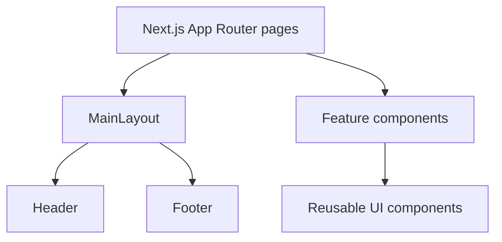

# DRAV E-Commerce Platform — Frontend
> Premium minimalist commerce interface with AI-assisted discovery UX

## Overview
DRAV Frontend is a Next.js App Router storefront for a modern e-commerce marketplace experience across buyer, account, and seller-facing pages. The UI focuses on minimalist visual language, editorial product discovery, and streamlined purchase flow from search to checkout. AI appears as a discovery layer in the search and recommendation UX, while backend model-serving integration is currently WIP.

The frontend is currently in development mode with static/mock product data, but it is already structured to map to the backend's complete schema direction (catalog, cart, orders, payments, reviews, and personalization signals).

## Features
- Full App Router page set for storefront, product, cart, checkout, account, seller profile, and policy/content pages
- Search results page with AI relevance framing (`Relevance (AI)` sort label and high-match visual indicators)
- Home page sections for personalized curation (`For you`, `Based on your activity`)
- Product detail flow with gallery thumbnails, size selection, and add-to-cart / wishlist actions
- Cart page with client-side quantity updates, remove-item actions, subtotal calculation, and empty-state handling
- Multi-section checkout UI (progress indicator, shipping form, payment method selector, order summary)
- Account area pages (dashboard and order history) with shared account sidebar navigation
- Seller showcase page with verified badge display and curated product collection layout
- Reusable layout system with sticky header and global footer navigation
- Theming via centralized design tokens in `app/globals.css` (color, typography, spacing, radius)

## Tech Stack
- Next.js `16.2.4`
- React `19.2.4`
- React DOM `19.2.4`
- TypeScript `^5`
- Tailwind CSS `^4`
- PostCSS `@tailwindcss/postcss ^4.2.4`
- ESLint `^9` with `eslint-config-next 16.2.4`
- Icons: `lucide-react ^1.14.0`
- Package manager lockfile present: `bun.lock` (Bun workflow supported)

## Architecture
This frontend follows component-driven App Router architecture:
- `app/`: route segments and page-level composition
- `components/`: reusable UI and feature components
- `layout`: global shell (header/footer)
- static/mock data currently lives inside route/component files (API integration WIP)



## Getting Started
### Prerequisites
- Node.js: version not pinned in repository (WIP; use current LTS)
- Bun: optional, for lockfile-aligned installs (version not pinned)

### Installation
```bash
git clone <your-frontend-repo-url>
cd drav-frontend

# choose one package manager
npm install
# or
bun install

# run dev server
npm run dev
# or
bun run dev
```

Application runs at `http://localhost:3000`.

### Environment Variables
No `.env.example` or `.env*` file is currently defined in this repository.

## Project Structure
```text
drav-frontend/
├── app/                    # App Router pages and global layout/styles
├── components/
│   ├── account/            # account area navigation components
│   ├── checkout/           # checkout flow components
│   ├── home/               # home/discovery presentation blocks
│   ├── layout/             # shared Header, Footer, MainLayout
│   ├── product/            # product detail gallery/details blocks
│   ├── search/             # search page header/filter/results components
│   └── ui/                 # reusable UI primitives (e.g., ProductCard)
├── public/                 # static assets
├── package.json            # scripts and dependency versions
├── next.config.ts          # Next.js config (remote image allowlist)
├── tsconfig.json           # TypeScript config
├── eslint.config.mjs       # ESLint setup for Next.js
└── postcss.config.mjs      # PostCSS/Tailwind plugin setup
```

## AI Integration
Current implementation is UI-oriented:
- Implemented in frontend UX: AI relevance messaging in search and personalized recommendation framing on home/search cards.
- Data source: currently static/mock arrays in page/component files; there is no runtime API call layer yet.
- Model/API details: no direct OpenAI/Gemini/LLM SDK usage in frontend code at this stage.
- Expected return shape (implied by UI): ranked products with match score/label and filter-aware metadata (WIP), likely informed by backend behavioral signals once `user_behavior` and review flows are fully wired.

## Deployment
No Dockerfile or `docker-compose.yml` is present in this repository.

Standard Next.js deployment workflow:
```bash
npm run build
npm run start
```

Can be deployed to any Next.js-compatible platform (e.g., Vercel, self-hosted Node runtime).

## Contributing
1. Create a branch from `main`.
2. Keep component APIs consistent with existing patterns in `components/`.
3. Run `npm run lint` and `npm run build` before opening a PR.
4. Open a PR with clear scope, screenshots for UI changes, and test/verification notes.
